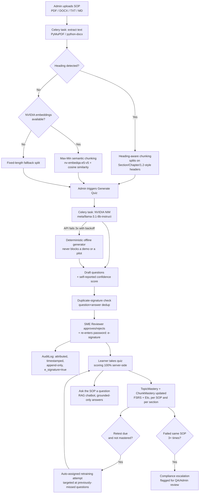

# GxP Training Bot

**Turn a pharma SOP into a role-specific, SME-approved quiz — with every AI-drafted question grounded in the source text, gated behind a human reviewer, and logged to an append-only compliance trail.**

Built for NVIDIA GenAI Bootcamp, Problem Statement **PS053** (Pharma & Life Sciences — GenAI Tutor track). Backend: Django REST Framework. Frontend: React + Vite. AI: **NVIDIA NIM** (`meta/llama-3.1-8b-instruct`, plus `nvidia/nv-embedqa-e5-v5` for embeddings). Async: Celery + Redis. DB: PostgreSQL (Docker-verified). CI: GitHub Actions. **219 automated tests, 0 fabricated claims in this README** — every feature described below is either read directly from the code in this repo or verified live.

> **Engineering documentation.** This project has been through a full reverse-engineering audit
> followed by a security and record-integrity hardening sprint. Start with
> [`docs/SRS.md`](docs/SRS.md) (what the system actually does),
> [`docs/GAP_ANALYSIS.md`](docs/GAP_ANALYSIS.md) (45 findings, honestly rated),
> [`docs/CHANGELOG.md`](docs/CHANGELOG.md) (what the sprint fixed, and what it deliberately
> did not), [`docs/SECURITY.md`](docs/SECURITY.md) (implemented controls **and** residual
> risks), [`docs/TESTING.md`](docs/TESTING.md) and [`docs/DEPLOYMENT.md`](docs/DEPLOYMENT.md).

---

## About

GxP Training Bot turns pharma standard operating procedures into role-specific, SME-approved quizzes — automating the drafting, not the accountability. A Django REST Framework backend calls NVIDIA NIM (Llama 3.1) for quiz generation and a RAG-based SOP chatbot, backed by a deterministic offline fallback so the pipeline degrades instead of breaking when the LLM is unreachable. Every AI-drafted question is gated behind a human reviewer's password-verified electronic signature, and role-based access control plus an append-only, 21 CFR Part 11-style audit trail cover the full API surface. Adaptive retraining runs two independent, continuously-updated models — an FSRS memory model (stability/difficulty) that replaces a fixed review schedule with one that actually fits how fast a learner forgets, and an Elo rating system (the same math chess uses) that tracks live question difficulty and learner ability instead of a one-time AI guess — at two granularities in parallel: per whole SOP, and per individual section, so a miss in one section no longer resets sections the learner has already mastered.

---

## Why this exists

Pharma and life-sciences manufacturers run continuous, auditable SOP training — new hires, quarterly requalification, SOP-version changes. Today that mostly means a QA trainer manually writing quiz questions from a 20-page procedure document, for every job role, every time the SOP changes. It's slow, inconsistent, and the "why was I wrong" moment — the actual learning event — usually gets skipped because writing a good compliance explanation per wrong answer is the most time-consuming part.

This project automates the *drafting*, not the *authority*. An SME still approves every question before a learner ever sees it, under an electronic signature. That's the design center of the whole system: **AI proposes, a qualified human disposes, and the system never lets you forget who did what and when.**

## System workflow



Every arrow above is a real code path, not an aspiration — see [Verified feature walkthrough](#verified-feature-walkthrough) for the file-level detail.

---

## Tech stack, and why each piece is there

| Layer | Choice | Why this, specifically |
|---|---|---|
| **LLM** | NVIDIA NIM, `meta/llama-3.1-8b-instruct` | OpenAI-compatible API, so the client code (`openai` SDK) needed zero rewiring to point at a different provider — the base URL and model name are the only two constants that change. Chosen for the NVIDIA GenAI Bootcamp track this project was built for. |
| **Embeddings** | NVIDIA `nvidia/nv-embedqa-e5-v5` | Used only as a *fallback* chunker (see below) — kept on the same provider as generation so there's one API key, one client, one failure mode to reason about. |
| **Backend** | Django + DRF | Batteries-included auth, ORM, and admin site meant the append-only audit log and RBAC could be built on primitives (`Group`, `permissions.BasePermission`, `ModelAdmin.has_*_permission`) instead of hand-rolled infrastructure — less custom code between "a reviewer clicks Approve" and "that action is provably attributable." |
| **Async** | Celery + Redis | LLM calls and PDF/DOCX parsing are the two genuinely slow operations in this app. Moving them off the request thread was non-negotiable for a real deployment; defaulting to `CELERY_TASK_ALWAYS_EAGER=True` (synchronous, in-process) for local dev means nobody needs a Redis container running just to `git clone` and try the app. |
| **Chunking** | Heading-aware → semantic (embeddings) → fixed-length, in that order | Not a single strategy — a cascade, each step justified by a specific finding (see [Research foundations](#research-foundations-what-we-read-the-gaps-we-found-and-what-we-built-because-of-them)). |
| **Adaptive scheduling** | FSRS (memory model) + Elo (difficulty/ability rating), both open-source algorithms, not hand-rolled heuristics — run at both whole-SOP and per-section granularity | A fixed review schedule and a static AI-guessed difficulty label are both wrong the moment real data disagrees with them. FSRS and Elo let those numbers correct themselves from actual answers instead — at a computational cost of a few floating-point operations per submission, no model training required. Running the same math per-section, not just per-SOP, means one weak section no longer drags a whole document's schedule back to square one. |
| **Database** | SQLite (dev) → PostgreSQL (Docker, CI, production path) | `DATABASE_URL`-driven, so the exact same code runs against both — SQLite for a zero-setup clone-and-run, Postgres verified via a real Docker container with real migrations for anything that needs to survive a restart or run in CI. |
| **Frontend** | React 18 + Vite | A single, fast-refreshing SPA (`App.jsx`, ~2,200 lines) covering login, dashboard, SOP library, generation, review, learner quiz, analytics, and role management — no router needed at this scope, no build-tool overhead beyond Vite's dev server. |
| **CI** | GitHub Actions | Backend job runs the full test suite against a **real Postgres service container** (not SQLite-in-CI-but-Postgres-in-prod drift), frontend job runs a production build. |
| **Containerization** | Docker Compose (db, redis, backend, celery-worker, frontend/nginx) | `docker compose up --build` is the actual, tested path to a Postgres+Redis+Celery deployment — not a Dockerfile that's never been run. |

---

## Research foundations: what we read, the gaps we found, and what we built because of them

This wasn't a guess-and-check build. Every non-obvious design decision below — the chunking cascade, the spaced-repetition scheduler, the confidence-score-aware retraining logic — traces to a specific paper or study, read *because* it was directly relevant to a gap this project actually had. Where the literature said "your instinct was right," that's noted too — a design decision that survives contact with the literature is worth more than one that was never checked.

<details>
<summary><strong>1. Should AI-drafted questions require a human approval gate?</strong> — validated, not just assumed</summary>

A 2026 systematic review (PRISMA-compliant, 71 empirical studies of LLM-generated MCQs across medical/health education, PubMed/Web of Science/Scopus/ERIC through Feb 2026) found factual or clinically implausible content in AI-generated questions ranging up to **45%** depending on the study — directly backing the decision to make SME approval a hard gate, not a nice-to-have, before any question reaches a learner.
→ [Postgraduate Medical Journal, "Validity of AI-generated multiple-choice questions in medical education: a systematic review"](https://academic.oup.com/pmj/advance-article/doi/10.1093/postmj/qgag057/8688271)

</details>

<details>
<summary><strong>2. Should chunking use embeddings, or is heading-aware splitting good enough?</strong> — cascade design, not a single answer</summary>

Two 2025 studies on RAG chunking strategy motivated the current three-tier cascade in `sops/services.py::chunk_text()`:

- **Kiss, Nagy & Szilágyi**, *"Max–Min semantic chunking of documents for RAG application,"* Discover Computing 28 (2025) — proposed the Max-Min algorithm (grow a chunk while every new sentence stays above a cosine-similarity floor against the whole chunk) used verbatim as this project's `_chunk_by_semantic_similarity()` fallback.
  → [Springer / Discover Computing](https://link.springer.com/article/10.1007/s10791-025-09638-7)
- **Moreno-Cediel, Garcia-Lopez, Garcia-Cabot & De-Fitero-Dominguez**, *"Optimising retrieval performance in RAG systems: a new growing window semantic chunking strategy to address weak semantic boundaries,"* Knowledge-Based Systems 331 (2025) — the specific finding that motivated *not* defaulting to fixed-length splitting: naive fixed-size splits create "weak semantic boundaries" that measurably hurt downstream retrieval.
  → [ScienceDirect](https://www.sciencedirect.com/science/article/pii/S0950705125019343)

The gap this closed: the original build only had heading-detection with a fixed-length fallback for un-headed documents. The fallback is now semantic (embeddings-based) chunking, with fixed-length only as the last resort when no `NVIDIA_API_KEY` is configured. Heading-aware chunking itself stayed the *first* choice — general 2026 industry evaluations of chunking strategy consistently found structure-aware splitting on well-formatted technical documents (which SOPs are, by regulatory convention) competitive with or better than semantic chunking, at zero embedding cost — so the cascade tries the cheap, high-precision option first and only pays for embeddings when the document doesn't cooperate.

</details>

<details>
<summary><strong>3. How should adaptive retraining decide *when* a learner is due for a retest?</strong> — a real algorithm-selection process, with a documented rejection</summary>

A second literature pass (22 sources on spaced repetition and knowledge tracing) benchmarked options before picking one:

- **Wilson, Karklin, Han & Ekanadham**, *"Back to the Basics: Bayesian extensions of IRT outperform neural networks for proficiency estimation,"* EDM 2016 — directly benchmarked Deep Knowledge Tracing against simpler Bayesian/IRT models and found the simpler models **matched or beat DKT**, especially at fine content granularity, while needing far less training data.
  → [arXiv:1604.02336](https://arxiv.org/abs/1604.02336)
- This is the empirical basis for **explicitly rejecting** Deep/neural knowledge tracing (Corbett & Anderson's Bayesian Knowledge Tracing, 1994; Piech et al.'s Deep Knowledge Tracing, NeurIPS 2015) as needing far more logged responses per skill than a training-bot deployment this size will ever generate, in favor of a **Leitner-style box scheduler** (Sebastian Leitner, 1972) plus a streak-based mastery threshold — implemented in `attempts/models.py::TopicMastery`.
- **Sapountzi et al.**, *"Personalized Stopping Rules in Bayesian Adaptive Mastery Assessment,"* EDM 2021 — the Bayesian decision-theoretic basis for the streak-based "3 correct in a row → mastered" stopping rule used here as a cheap, discrete approximation.
  → [arXiv:2103.03766](https://arxiv.org/pdf/2103.03766)
- **Ye, Su & Cao**, *"A Stochastic Shortest Path Algorithm for Optimizing Spaced Repetition Scheduling,"* KDD 2022, and **Settles & Meeder**, *"A Trainable Spaced Repetition Model for Language Learning,"* ACL 2016 (the model behind Duolingo's Half-Life Regression) — both make the case against treating every quiz item as equally hard; this project's mastery-weighting in `attempts/views.py::_elo_weight()` is the direct descendant of that idea (see entry 5 below for how it evolved from a static easy/medium/hard lookup into a live rating).
  → [ACM / KDD 2022](https://dl.acm.org/doi/10.1145/3534678.3539081)
- **Khalafi, Fallah & Sharif-Nia**, *"The effect of spaced learning on the learning outcome and retention of nurse anesthesia students: a randomized-controlled study,"* BMC Medical Education 24, 322 (2024) — a controlled study, from a regulated clinical-training context structurally close to GxP, providing direct evidence that spaced re-testing improves retention in exactly this kind of high-stakes procedural training.
  → [BMC Medical Education](https://bmcmededuc.biomedcentral.com/articles/10.1186/s12909-024-05290-9)

**The gap named and left open, on purpose:** no peer-reviewed study was found evaluating adaptive retraining specifically in GxP/pharma compliance training. That's noted as this project's actual novel-contribution angle, not glossed over as solved.

</details>

<details>
<summary><strong>4. Can we trust the LLM's own confidence score when deciding whether a wrong answer should reset a learner's schedule?</strong></summary>

**Geng, Cai, Wang, Koeppl, Nakov & Gurevych**, *"A Survey of Confidence Estimation and Calibration in Large Language Models,"* NAACL 2024 — the finding that LLM self-reported confidence is often miscalibrated directly shaped `attempts/views.py::_retraining_pass_signal()`: a wrong answer on a *low*-confidence AI-drafted question (below `CONFIDENCE_TRUST_THRESHOLD = 0.5`) is excluded from mastery-scoring weight, so an ambiguous AI-drafted question can't unfairly reset a learner who otherwise knows the material cold.
→ [ACL Anthology](https://aclanthology.org/2024.naacl-long.366/)

</details>

<details>
<summary><strong>5. Should the review interval and item difficulty stay fixed, or be continuously fit from real answers?</strong> — a follow-up pass that upgraded two static numbers into two live ones</summary>

Entry 3 above explains why this project uses a Leitner-style box scheduler instead of neural knowledge tracing. That still holds — but a fixed `[1, 2, 4, 7, 14, 30]`-day table applied identically to every learner and every SOP, and a question's difficulty was whatever the LLM guessed once at generation time and never revisited. Two follow-up upgrades replaced both of those static numbers with ones that correct themselves from real data, without needing the training-data volume that ruled out DKT/BKT in the first place:

- **FSRS** (Free Spaced Repetition Scheduler; open-spaced-repetition project) — replaces the fixed interval table with a per-(learner, SOP) memory model of stability and difficulty, fit on hundreds of millions of real review logs and shown to need 20-30% fewer reviews than SM-2/Leitner for the same retention. Implemented in `attempts/fsrs.py` using the project's own published default weights (this deployment doesn't have anywhere near enough review volume to fit its own — the same reasoning entry 3 already applies to DKT), wired into `TopicMastery.apply_answer()` in place of the old `BOX_INTERVAL_DAYS` lookup.
  → [FSRS benchmark results](https://expertium.github.io/Benchmark.html), [open-spaced-repetition project](https://github.com/open-spaced-repetition)
- **Pelánek**, *"Applications of the Elo rating system in adaptive educational systems,"* Computers & Education 98 (2016) — the same rating math chess uses, applied so that every answered question nudges both the learner's ability rating and the question's own difficulty rating, rather than trusting the AI's one-time difficulty label forever. Implemented in `attempts/services.py::apply_elo_update()`, replacing the static easy/medium/hard weighting in `attempts/views.py` and the streak-based `suggested_difficulty` heuristic in `auto_assigned_retraining`. A direct, practical side effect: a learner transferring in with real prior knowledge is recognised as such within a handful of answers, instead of being treated identically to a first-day hire because both start at `box_index=0`.
  → [Computers & Education 98](https://dl.acm.org/doi/10.1016/j.compedu.2016.03.017)

`box_index` / `streak_correct` / `mastery_status` (entry 3's stopping rule) were deliberately left untouched by this pass — FSRS and Elo replace *when* and *how hard*, not *whether to stop reviewing a mastered topic*, which is a separate decision.

</details>

<details>
<summary><strong>6. Should mastery be tracked per whole SOP, or per section?</strong> — the gap entry 5 named as still open, now closed</summary>

Entry 5 left one thing unresolved: `TopicMastery` was one row per (learner, whole SOP) — a 10-section SOP was one mastery unit, so a learner weak on a single section still got the entire document's schedule reset and got re-tested on everything, not just the section they missed. No single paper drove this one; it's a direct structural consequence of `Question.source_chunk` already existing (every AI-drafted question already links back to the specific section it came from) — the data to fix this was already there, just not aggregated at that granularity.

The fix, implemented in `attempts/models.py`: the shared FSRS/Elo/streak logic was extracted into an abstract `MasteryState` base class, and a new `ChunkMastery` model — one row per (learner, `SOPChunk`) — runs in parallel with the existing whole-SOP `TopicMastery`, updated from the same completed attempt (`QuizAttemptViewSet.submit()` in `attempts/views.py`, grouping that attempt's answers by `source_chunk`). `TopicMastery` was deliberately **not** rewritten to derive its status from `ChunkMastery` (e.g. "mastered once every section is mastered") — some questions have no `source_chunk` at all (manually authored, or predating chunk linkage), which would make whole-SOP mastery permanently unreachable under a chunk-derived rule. The two are independent signals computed from the same attempt, not one built from the other.

One implementation wrinkle worth naming: a single answer now feeds two ability estimates (whole-SOP and section). The Elo update in `attempts/services.py::apply_elo_update()` is symmetric — it moves both the learner's rating *and* the question's own difficulty rating together. Running it twice for one answer would move the question's difficulty rating twice for a single real event, so the section-level update calls a new one-sided variant, `apply_elo_update_ability_only()`, which moves only the ability side.

`GET /api/attempts/section-mastery/` (Admin/SME) surfaces this at section granularity — the direct answer to "which specific section is this learner weak in," not just which whole SOP — and `auto_assigned_retraining`'s targeting now prioritizes questions from genuinely unmastered sections over the older "anything ever missed" heuristic.

</details>

The full literature list, synthesis notes, and day-by-day log of what was built in response to each finding lives in [`ROADMAP.md`](ROADMAP.md) (Days 5–7).

---

## Verified feature walkthrough

### 1. SOP ingestion → chunking
`POST /api/sops/documents/` (Admin only, server-side file-type allowlist + 20MB cap) → `POST /api/sops/documents/{id}/process/` runs `sops/tasks.py` as a Celery task, extracting text (`PyMuPDF` for PDF, `python-docx` for DOCX) and chunking it via the cascade described above. A `SOPChunk.chunking_strategy` field records which tier actually fired (`heading` / `semantic` / `fixed_length`) per chunk — so the pipeline's own behavior is auditable, not just its output.

### 2. AI-drafted question generation
`POST /api/ai_engine/generate/` (Admin only) dispatches a Celery task that, per SOP chunk, prompts NVIDIA NIM for role-specific MCQs **with a self-reported confidence score per question** and an explanation that must state why the correct answer is compliant *and* why each wrong option is a compliance risk — the direct implementation of PS053's "explain wrong answers" requirement. On any API failure, `generate_questions_with_nvidia_nim()` retries up to 3 times with linear backoff before the caller transparently falls back to a deterministic offline generator — so a bad Wi-Fi connection during a live demo, or a real API outage in production, degrades gracefully instead of failing the whole workflow. A content-signature check (`question_text` + `correct_answer`, normalized) skips near-duplicate drafts instead of flooding the review queue.

### 3. SME review, under an electronic signature
`PATCH /api/quiz/questions/{id}/approve/` (or `/reject/`) requires the reviewer's **password in the request body**, verified server-side via `check_password()` — not just an already-authenticated session. A missing or wrong password returns `400` and changes nothing; a successful signature is recorded as `details.e_signature: true` in the audit log. This is a real 21 CFR Part 11-style control, not a UI checkbox.

### 4. Learner quiz, scored server-side
`POST /api/attempts/quiz-attempts/{id}/submit/` grades entirely from `Option.is_correct` server-side — the client cannot influence its own score. Every wrong or unanswered question surfaces the learner's answer, the correct answer, and the stored compliance explanation on the results screen.

### 5. Adaptive retraining — a real scheduler, not a suggestion
Every completed attempt updates `TopicMastery` (one row per learner+SOP) along two independent tracks. The **stopping-rule track**: correct → increment a streak (and a display-only `box_index`, capped at 5); wrong → reset both to 0. Three correct in a row → `mastered`, and the topic stops being surfaced. The **scheduling track**: an FSRS memory model (`attempts/fsrs.py`) computes a stability/difficulty pair from the answer and however many days it's been since the last review, and `next_eligible_at` is set from FSRS's own forgetting-curve interval — not a fixed day-count, and different per learner and per SOP. Alongside this, each answered question also updates an Elo rating pair (`attempts/services.py`): the question's own live difficulty, and the learner's ability on this SOP — used both to weight the pass/fail signal that drives the stopping-rule track, and to pick a live-data `suggested_difficulty` instead of guessing off streak count. `GET /api/attempts/auto-assigned/` doesn't just suggest a due topic — it **pre-creates the actual `QuizAttempt`** (idempotently — reloading the page doesn't spawn duplicates) and targets it at the specific questions the learner previously got wrong, falling back to the full approved set if there's no miss history yet.

The same two tracks also run **per individual section**, not just per whole SOP — see [Research foundations, entry 6](#research-foundations-what-we-read-the-gaps-we-found-and-what-we-built-because-of-them). A `ChunkMastery` row exists per (learner, `SOPChunk`), updated from the same attempt in parallel with `TopicMastery`, so a miss in one section no longer resets a different section's already-earned streak. `auto_assigned_retraining` targets retests at genuinely unmastered sections first; `GET /api/attempts/section-mastery/` (Admin/SME) shows exactly which section a learner is weak in, not just which SOP.

### 6. Compliance escalation
A learner who fails the *same* SOP three or more times isn't just cycled through another retest silently — `retraining_escalation` is written to the audit trail, and `GET /api/attempts/retraining-status/` (Admin/SME only) surfaces every learner currently stuck in a retraining loop, sorted by how many times they've failed, so a real compliance risk (someone who structurally can't pass a safety procedure) gets human eyes instead of disappearing into an infinite spaced-repetition loop.

### 7. RAG-based SOP chatbot
Any authenticated user can ask a free-text question about a processed SOP. Retrieval is deliberately simple — lexical (word-overlap) scoring over the SOP's own chunks rather than a second embeddings index, since a typical SOP has only a handful of chunks and this avoids new infrastructure for a small-corpus problem. The prompt instructs the model to answer *only* from the retrieved chunk text and say so plainly if the SOP doesn't cover the question — direct hallucination mitigation, not just a good-faith prompt. The offline fallback quotes the best-matching chunk verbatim instead of generating prose, so the feature works with zero API dependency.

### 8. Append-only audit trail
Every SOP upload/process/failure, every question generation/approval/rejection (with `e_signature: true`), every quiz submission, auto-assignment, and escalation event writes an `AuditLog` row — `user`, `action`, `object_type`/`object_id`, a human-readable summary, and a structured JSON `details` blob. The Django admin registration explicitly returns `False` from `has_add_permission` / `has_change_permission` / `has_delete_permission` — the trail can only grow. Admin-only read API, plus a one-click CSV export (`GET /api/audit/logs/export/`).

---

## Engineering rigor

- **219 automated tests** (`accounts`, `sops`, `ai_engine`, `quiz`, `attempts`, `analytics`, `audit`) — including a dedicated suite proving the learner-facing API never discloses the answer key, that a completed attempt cannot be resubmitted, that approved/e-signed content is immutable, and that the signature is bound to a content hash. Both P0 fixes were verified by temporarily disabling the guard and confirming the new tests fail (see [`docs/TESTING.md`](docs/TESTING.md)). Plus RBAC boundary tests from *both* the permitted and denied side of every gated action, electronic-signature boundary tests (missing password / wrong password), forced-offline-fallback tests for both AI generation and the SOP chatbot (CI never needs a live NVIDIA API key), adaptive-retraining scheduling tests covering box advancement, streak resets, and low-confidence-question exclusion, dedicated FSRS/Elo test suites (pure algorithm behavior plus end-to-end submission tests) covering both rating systems independently, and a section-mastery suite covering the exact scenario that feature exists for — a miss in one section not resetting an already-strong one — plus a regression guard proving a question's Elo rating moves exactly once per answer, not twice, now that two mastery tracks can both reference it.
- **Two real regression tests exist because two real bugs were found and fixed** — a stale Django `prefetch_related` cache silently returned `chunks: 0` right after chunks were successfully created (SOP processing), and the identical class of bug returned an empty `answers` array on a quiz submission that had, in fact, scored correctly. Both are now permanently covered by tests named for the bug they prevent from coming back.
- **CI (`.github/workflows/ci.yml`)**: backend tests run against a real PostgreSQL service container, not SQLite standing in for it; frontend job runs a production Vite build.
- **Docker Compose**, run and verified end-to-end: Postgres, Redis, a Celery worker, and the Django backend, with the NVIDIA NIM call watched live in the worker's own logs, not just asserted to work.

## Roles

Three tiers, checked server-side via `accounts/permissions.py` — never just hidden in the UI:

| Role | Can | Cannot |
|---|---|---|
| **Admin** (`is_staff` or `Admin` group) | Upload/process SOPs, trigger generation, manage job roles & learners, approve/reject, see every attempt, read the audit log | — |
| **SME Reviewer** (`SME` group) | Approve/reject questions (with e-signature) | Upload SOPs, trigger generation, see other learners' attempts |
| **Learner** | Take quizzes, see their own attempts and adaptive-retraining schedule | Everything above |

## Quickstart

```bash
# Backend (SQLite, synchronous tasks — nothing else to install)
cd backend
uv sync
copy .env.example .env   # then set NVIDIA_API_KEY — free key at https://build.nvidia.com/
uv run python manage.py migrate
uv run python manage.py seed_demo
uv run python manage.py runserver

# Frontend
cd frontend
npm install
npm run dev
```

```bash
# Full stack (Postgres + Redis + Celery worker + nginx), Docker-verified
docker compose up --build
```

```bash
# Test suite
cd backend
uv run python manage.py test
```

Demo accounts (`seed_demo`, password `demo12345` for all): `anjali` (Admin), `vikram` (SME Reviewer), `rohit`/`priya`/`arun`/`sneha`/`karan` (Learners, one per job role).

## Project structure

```text
gxp-training-bot/
  backend/
    accounts/      # Job roles, learner profiles, auth, RBAC permission classes
    sops/          # Upload, extraction, 3-tier chunking cascade, Celery task
    quiz/          # Questions, options, e-signature-gated approval workflow
    attempts/      # Quiz attempts, scoring, adaptive retraining, escalation
    ai_engine/     # NVIDIA NIM generation + RAG chatbot, Celery task
    analytics/     # Dashboard summary, weak-topics, recommended refresher
    audit/         # Append-only compliance log, CSV export
    config/        # Settings, URLs, Celery app config
  frontend/src/     # React SPA (App.jsx), API client, styles
  docs/             # Full SRS (docx)
  docker-compose.yml
  ROADMAP.md        # Day-by-day build log, incl. full literature-review notes
  DEMO_SCRIPT.md    # Rehearsable live-demo walkthrough
  .github/workflows/ci.yml
```

## What's next

See [`ROADMAP.md`](ROADMAP.md) and [`docs/SECURITY.md`](docs/SECURITY.md) §9 for the full production-readiness roadmap (secrets management, TLS, rate limiting, observability, horizontal scaling) and a designed-but-not-yet-built n8n workflow-automation integration.

Adaptive learning specifically: all three upgrades identified as worth pursuing are done — FSRS scheduling, Elo-rated difficulty/ability, and per-section mastery (see [Research foundations, entries 5 and 6](#research-foundations-what-we-read-the-gaps-we-found-and-what-we-built-because-of-them)). What's not built on top of that: `ChunkMastery` doesn't yet feed back into `TopicMastery`'s own status (e.g. surfacing "9/10 sections mastered" as a progress indicator, not just a pass/fail flag), and there's no UI yet for a learner to see their own per-section breakdown — `GET /api/attempts/section-mastery/` is Admin/SME-facing only today.

Two other nearest open items in the codebase itself: a frontend test suite (backend has 219 tests, frontend has none yet), and multi-turn memory for the SOP chatbot (today it's single-turn: one question, one grounded answer).

The largest deferred items after the hardening sprint — SOP version lifecycle, a training assignment/completion model, and tamper-evident audit storage — are recorded with their rationale in [`docs/CHANGELOG.md`](docs/CHANGELOG.md) and [`docs/IMPLEMENTATION_PLAN.md`](docs/IMPLEMENTATION_PLAN.md).
