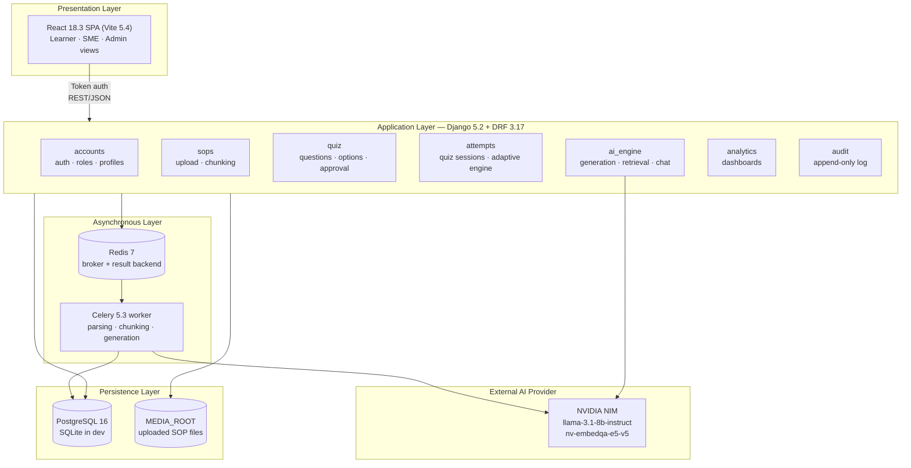
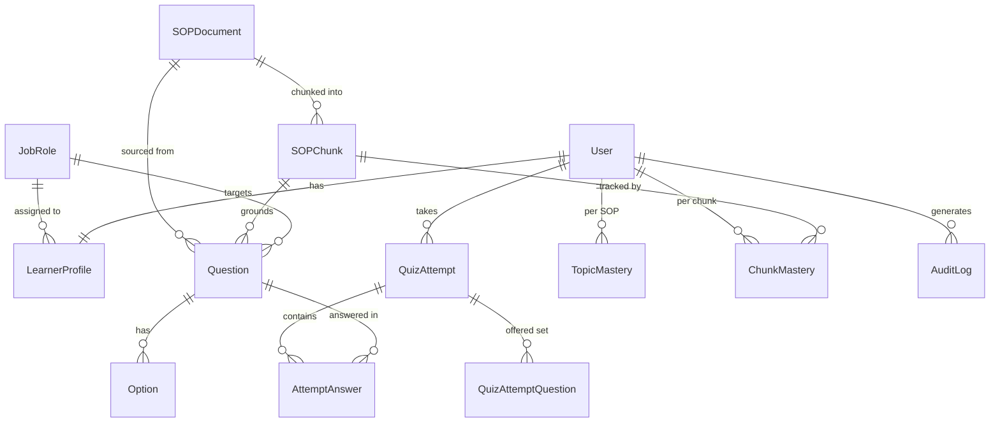
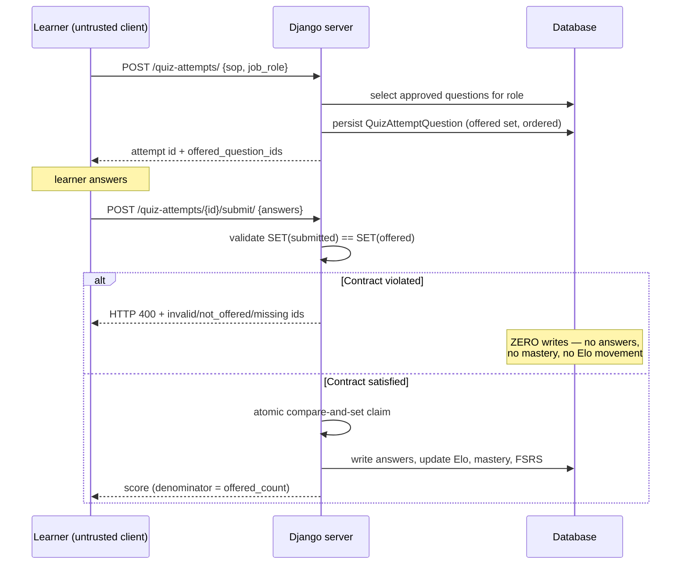
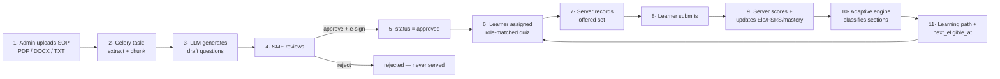
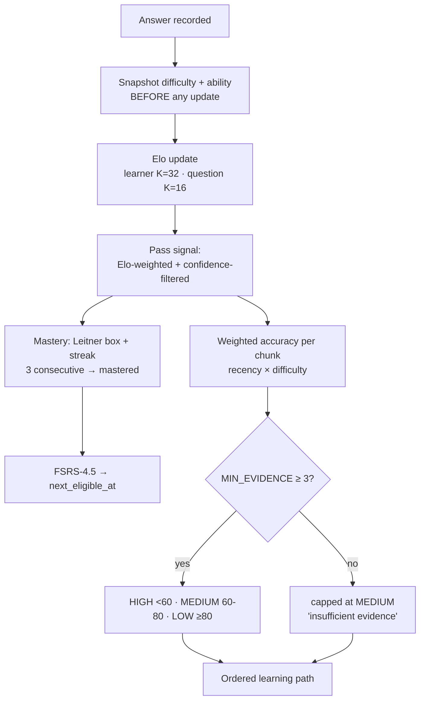

# System Requirements Document
# GxP Training Bot

| Field | Value |
|---|---|
| **Project** | GxP Training Bot — AI-assisted SOP training and assessment platform |
| **Document type** | System Requirements Document (SRD) — problem, objectives, literature basis, architecture, workflow, tech stack, gaps, future scope |
| **Baseline** | branch `main`, working tree as of 7 September 2026 |
| **Verified test status** | **330 automated backend tests** across 7 Django apps |
| **Method** | Every technical statement below was read from source, models, migrations, routes, config, CI and tests. Nothing is aspirational. |

> **Compliance disclaimer.** This system is **GxP-*oriented*** — it is designed around the
> control concepts that GxP training records require (human approval, electronic signature,
> audit trail, provenance). It has **not** been validated, qualified, or certified against
> 21 CFR Part 11, EU GMP Annex 11, or any regulatory standard. It must not be described as
> "GxP compliant". Section 10 lists exactly what would be required before such a claim.

**Companion documents:** [`SRS.md`](SRS.md) · [`ARCHITECTURE.md`](ARCHITECTURE.md) ·
[`ERD.md`](ERD.md) · [`API.md`](API.md) · [`ADAPTIVE_LEARNING.md`](ADAPTIVE_LEARNING.md) ·
[`KT_DATA_READINESS.md`](KT_DATA_READINESS.md) · [`IMPLEMENTATION_MASTER_CHECKLIST.md`](IMPLEMENTATION_MASTER_CHECKLIST.md)

---

## Table of Contents

1. [Problem Statement](#1-problem-statement)
2. [Objectives](#2-objectives)
3. [Literature Review](#3-literature-review)
4. [How the System Solves the Problem](#4-how-the-system-solves-the-problem)
5. [System Architecture](#5-system-architecture)
6. [Workflow](#6-workflow)
7. [Technology Stack](#7-technology-stack)
8. [Functional Requirements](#8-functional-requirements)
9. [Non-Functional Requirements](#9-non-functional-requirements)
10. [Known Gaps in This Version](#10-known-gaps-in-this-version)
11. [Future Scope](#11-future-scope)

---

# 1. Problem Statement

## 1.1 Domain context

Pharmaceutical, biotech and medical-device manufacturing operate under **GxP** — the
collective term for Good Manufacturing, Laboratory and Clinical Practice regulations. A
central obligation of these regimes is that **every person performing a regulated task must
be demonstrably trained on the current version of the Standard Operating Procedure (SOP)
governing that task**, and that this training must be *documented, attributable and
auditable*.

A mid-size pharmaceutical site typically maintains **several hundred to several thousand
SOPs**, revised on a rolling basis. Each revision re-triggers a training obligation for
every affected role.

## 1.2 The four failures of the current process

The prevailing industrial practice is manual: a Subject Matter Expert (SME) reads the SOP
and hand-writes a multiple-choice assessment in a word processor or an LMS form.

**Failure 1 — Assessment authoring does not scale.**
Writing a defensible 10-question assessment from a 30-page SOP is a multi-hour SME task.
Multiplied across a document library and a revision cycle, assessment authoring becomes the
bottleneck that determines how fast a site can roll out a procedural change. In practice
sites respond by *reusing* stale assessments against revised SOPs — which silently breaks
the link between what was trained and what the procedure now says.

**Failure 2 — Training is uniform where competence is not.**
Standard practice assigns every learner the same fixed question set, and treats a single
pass mark as proof of competence. This is wrong in both directions. A learner who
demonstrably understands Sections 1–4 and consistently fails Section 5 is re-trained on all
five, wasting production time. Conversely, a learner who scrapes a 70% pass by answering
only the easy items is recorded as qualified, with no record of *which* part of the
procedure they cannot perform. **The system has no representation of partial competence.**

**Failure 3 — Retraining intervals are calendar-driven, not evidence-driven.**
Periodic retraining is typically annual, applied identically to everyone. It is decoupled
from any measurement of whether the individual has actually forgotten the material.
Human forgetting is well established to follow an approximately exponential decay whose
rate varies by item difficulty and by individual review history — a fixed annual interval
is therefore simultaneously too frequent for well-consolidated knowledge and far too
infrequent for weakly-held, high-risk knowledge.

**Failure 4 — Naive AI adoption creates a *worse* compliance position, not a better one.**
The obvious response to Failure 1 is "have an LLM write the questions". Done naively this
is actively dangerous in a regulated setting, for four distinct reasons:

| Risk | Consequence in a GxP setting |
|---|---|
| **Hallucination** | A generated question may test a procedural step the SOP does not contain. A learner is then assessed — and recorded as qualified — against a fabricated procedure. |
| **No provenance** | If a question cannot be traced to a specific clause of a specific SOP version, the training record is not defensible under audit. |
| **No human accountability** | Regulations require an identified, qualified human to be accountable for training content. A model is not an accountable person. |
| **Miscalibrated self-assessment** | LLM self-reported confidence is poorly calibrated (see §3.7), so it cannot be trusted as an automatic quality gate. |

## 1.3 Consolidated problem statement

> Pharmaceutical SOP training is **slow to author, uniform where it should be
> individualised, scheduled by the calendar rather than by evidence of retention, and not
> safely improvable by naive LLM automation** — because unconstrained generative AI removes
> the provenance and human accountability that make a training record defensible in the
> first place.
>
> The problem is therefore **not** "can an LLM write quiz questions" (it can). The problem is:
> **how do you place a generative model inside a workflow that must remain traceable,
> human-accountable and auditable — and how do you use the resulting interaction data to
> individualise training without fabricating evidence of competence you have not measured?**

---

# 2. Objectives

## 2.1 Primary objectives

| ID | Objective | Success criterion | Status |
|---|---|---|---|
| **O1** | Generate role-specific assessment items automatically from SOP text | Questions generated from an uploaded SOP, each linked to a source chunk | **Met** |
| **O2** | Guarantee provenance for every generated item | `Question.source_chunk` FK; generation constrained to supplied chunk text | **Met** |
| **O3** | Enforce human accountability before any learner exposure | `status='draft'` by default; SME approval under password e-signature required to reach `approved` | **Met** |
| **O4** | Degrade safely when the AI provider is unavailable | Deterministic offline generator on any API failure, timeout or missing key | **Met** |
| **O5** | Individualise training at *section* granularity, not document granularity | `ChunkMastery` per (learner, chunk); section-level priority classification | **Met** |
| **O6** | Schedule retraining from evidence of retention, not the calendar | FSRS-4.5 memory model producing `next_eligible_at` | **Met** |
| **O7** | Maintain an append-only audit trail of regulated events | `AuditLog` with no update/delete API surface | **Met** |
| **O8** | Make assessment integrity tamper-resistant server-side | Exact-set offered-question contract; server-side scoring | **Met** |
| **O9** | Measure retrieval quality objectively rather than by demonstration | Hand-labelled gold set + offline Hit@1/Recall@k/MRR harness | **Met** |
| **O10** | Establish a leakage-safe evaluation harness for any future predictive model | Per-learner temporal splitting; refuses to report metrics on insufficient data | **Met** |

## 2.2 Explicit non-objectives

These were considered and **deliberately excluded**, each for a stated engineering reason.
Recording them matters: an unstated non-objective reads as an oversight.

| Non-objective | Reason for exclusion |
|---|---|
| Train a neural knowledge-tracing model (DKT/SAKT/SAINT) | The deployment holds interaction counts **three to four orders of magnitude** below what these architectures require. See §3.3 and [`KT_DATA_READINESS.md`](KT_DATA_READINESS.md). |
| Deploy a dedicated vector database | Retrieval currently operates over tens of chunks. A vector DB would add operational surface with no measured benefit. Roadmap item P2-002 evaluates `pgvector` *first*, because PostgreSQL is already deployed. |
| Build an autonomous agentic layer | An agent that can act on training records without human approval directly contradicts objective O3. Roadmap P4-001 requires proof of measurable benefit before any agent is built. |
| Claim GxP compliance | Compliance is a validation outcome, not a code property. See §10.1. |

---

# 3. Literature Review

Every paper below is **cited in the source code at the specific line where it influenced a
decision**. This section is not a general survey; it documents the research that actually
changed the implementation. File references are exact.

## 3.1 Elo rating for adaptive educational systems

> **Pelánek, R.** (2016). *Applications of the Elo rating system in adaptive educational
> systems.* **Computers & Education, 98**, 169–179.

**Finding.** The Elo system — originally chess ranking — functions as an efficient online
estimator of both learner ability and item difficulty. It is a strong practical
approximation to Item Response Theory's one-parameter (Rasch) model, but updates
incrementally per response and requires no batch re-fitting.

**Applied at:** `attempts/services.py:3`

**Implementation.** Paired ratings, both seeded at 1500:
- Learner ability, `K = 32` (`LEARNER_K_FACTOR`)
- Question difficulty, `K = 16` (`QUESTION_K_FACTOR`) — deliberately slower, because a
  question's difficulty is a property of the item and should not swing on one learner.
- Difficulty labels seed the rating: `DIFFICULTY_SEED_ELO = {easy: 1300, medium: 1500, hard: 1700}`

**Why it fits this problem.** It solves the cold-start and small-data problem that rules out
neural approaches (§3.3). Elo produces a usable difficulty estimate from the *first* response
and degrades gracefully — with no data it returns the seed, which is exactly the prior a
human SME assigned.

## 3.2 FSRS-4.5 — the memory model

> **Open Spaced Repetition project.** *FSRS-4.5 (Free Spaced Repetition Scheduler)* —
> a Difficulty–Stability–Retrievability (DSR) model with 17 published weights.

**Applied at:** `attempts/fsrs.py:7` (17 weights in `W`, used verbatim)

**Implementation.**
- `DESIRED_RETENTION = 0.9` — the next review is scheduled for the point at which predicted
  recall probability falls to ~90%
- `MIN_INTERVAL_DAYS = 1.0` — never schedules "later today"
- Retrievability: `R(t, S) = (1 + F·t/S)^C` where `F = 19/81`, `C = -0.5`

**Why FSRS and not a Leitner box alone.** A Leitner box advances on a fixed ladder; FSRS
models *stability* as a continuous quantity that responds to item difficulty and review
history. This directly addresses Failure 3 — it replaces a calendar interval with a
per-learner, per-item prediction of when forgetting will occur.

**Important limitation, honestly stated.** FSRS answers *"when should this be reviewed?"*
It cannot answer *"what should be reviewed?"* — because at elapsed time zero, `R(0,S) = 1.0`
for every stability value. All items look equally well-known the moment they are answered.
Content *selection* therefore uses the separate recency- and difficulty-weighted accuracy
engine described in §3.5/§3.6, not FSRS.

## 3.3 Why neural knowledge tracing was rejected

> **Wilson, K. H., Karklin, Y., Han, B., & Ekanadham, C.** (2016). *Back to the basics:
> Bayesian extensions of IRT outperform neural networks for proficiency estimation.*
> **Proceedings of EDM 2016.**

**Finding.** Well-specified probabilistic models (IRT variants) match or outperform Deep
Knowledge Tracing on proficiency estimation, particularly at realistic data scales.

**Applied at:** `attempts/models.py:134` — cited as the explicit justification for **not**
implementing neural KT.

**The data argument, measured on this deployment:**

| Model class | Typical training requirement | Available here |
|---|---|---|
| BKT (per skill) | Hundreds of interactions **per skill** | ~1.6 per chunk |
| PFA / logistic | 10³–10⁴ interactions | tens |
| DKT | ~5×10⁵–10⁶ | tens |
| SAKT / SAINT / AKT | 10⁵–10⁷ | tens |

**This is a three-to-four order of magnitude gap.** Implementing a transformer-based KT
model here would produce a model that *looks* trained while encoding essentially nothing but
noise and the demo script. Rejecting it is the load-bearing engineering decision of this
project.

## 3.4 Mastery stopping rule

> **Sapountzi, A., et al.** (2021). **Proceedings of EDM 2021.**

**Applied at:** `attempts/models.py:131`

**Implementation.** A discrete approximation of the paper's Bayesian stopping rule: **three
consecutive correct answers** on a chunk transitions it to `mastered`. A streak counter is
used rather than a full posterior because, at this data scale, the posterior would be
dominated by its prior.

## 3.5 Difficulty-weighted scoring

> **Ye, J., Su, J., & Cao, Y.** (2022). *A Stochastic Shortest Path Algorithm for Optimizing
> Spaced Repetition Scheduling.* **KDD 2022.**
>
> **Settles, B., & Meeder, B.** (2016). *A Trainable Spaced Repetition Model for Language
> Learning.* **ACL 2016.**

**Finding (both).** Treating every item as equally hard **understates what a learner
actually knows**. A learner who misses only the hard items is materially different from one
who misses everything, and a flat accuracy metric cannot distinguish them.

**Applied at:** `attempts/views.py:28-30` (pass signal) and `attempts/adaptive.py:111` (priority)

**Implementation.** Question Elo is linearly mapped onto a 1.0–2.0 evidence weight:

```
w_i = 0.5^(i / RECENCY_HALF_LIFE)  ×  difficulty_weight_i
```

Because this is a weighted *average*, the effect is symmetric: a hard item contributes more
evidence in **either** direction — missing it depresses the score further, answering it
correctly lifts the score further.

**A non-obvious design decision, recorded because it matters.** The weight uses
`AttemptAnswer.question_difficulty_at_answer` — the difficulty **snapshotted when the answer
was given** — not the question's live Elo. Using the live rating would mean a section's past
accuracy silently drifts whenever *any other learner* answers, and a decision made today
could not be reproduced tomorrow. In a compliance context, **a past decision must stay
explainable exactly as it was made.**

## 3.6 Recency weighting

**Applied at:** `attempts/adaptive.py:55-70`

Not drawn from a single paper; it is the standard exponential-decay treatment of a
competence signal. `RECENCY_HALF_LIFE = 5.0`, so an answer five answers ago carries half the
weight of the newest.

Verified numerically in the source comments:

| Sequence | Weighted | Lifetime | Effect |
|---|---|---|---|
| 0/5 then 5/5 (improving) | 66.7% | 50% | HIGH → MEDIUM |
| …then 5 more correct | 85.7% | — | MEDIUM → LOW |
| 5/5 then 0/5 (declining) | 33.3% | 50% | flagged sooner than lifetime accuracy would |

Both improvement and deterioration are recognised, and **neither instantly** — a single good
answer cannot erase a history of failure, which is the correct behaviour for a compliance
training record.

An evidence floor (`MIN_EVIDENCE = 3`) prevents a section being classified LOW on fewer than
three answers. It is deliberately **asymmetric**: weak performance on a small sample is still
treated as weak, because the cost of over-training is a few extra questions while the cost of
under-training is an unqualified operator.

## 3.7 LLM confidence calibration

> **Geng, J., et al.** (2024). *A Survey of Confidence Estimation and Calibration in Large
> Language Models.* **NAACL 2024.**

**Finding.** LLM self-reported confidence is frequently miscalibrated — models are often
confidently wrong.

**Applied at:** `attempts/views.py:41`, `CONFIDENCE_TRUST_THRESHOLD = 0.5`

**Implementation.** Self-reported confidence is **not** used as an automatic quality gate
(the paper's finding forbids that). It is used only for a narrow, conservative purpose: a
wrong answer on a *low-confidence, AI-drafted* question does not reset the learner's
schedule, on the reasoning that the question itself may be ambiguous. This is the weakest
possible use of an untrusted signal — it can only ever protect a learner, never qualify one.

## 3.8 Semantic chunking

> **Kiss, A., Nagy, B., & Szilágyi, L.** (2025). *Max-Min semantic chunking of documents for
> RAG application.* **Discover Computing.**
>
> **Moreno-Cediel, A., et al.** (2025). *Optimising retrieval performance in RAG systems.*
> **Knowledge-Based Systems.**

**Findings.** Max-Min chunking grows a chunk while the newest sentence's similarity to
**every** sentence already in the chunk stays above a threshold. Moreno-Cediel et al.
demonstrate that fixed-size splits create *"weak semantic boundaries"* that measurably
degrade downstream retrieval.

**Applied at:** `sops/services.py:89-96`

**Implementation — a three-tier cascade:**

1. **Heading-aware** (preferred) — split on the document's own structure
   (`Section 2: Gowning Sequence`, `3.1 Cleaning Verification`)
2. **Max-Min semantic** (fallback) — embeddings via `nvidia/nv-embedqa-e5-v5`,
   cosine threshold `0.5`
3. **Fixed-length** (last resort) — only if no API key or the embedding call fails

Each chunk records which strategy produced it (`SOPChunk.chunking_strategy`), so retrieval
quality can be attributed to chunking method after the fact.

---

# 4. How the System Solves the Problem

Direct mapping from each failure in §1.2 to the mechanism that addresses it.

## 4.1 Failure 1 — Authoring does not scale

**Mechanism: grounded LLM generation with enforced provenance.**

| Component | Detail |
|---|---|
| Model | `meta/llama-3.1-8b-instruct` via NVIDIA NIM (OpenAI-compatible endpoint) |
| Prompt constraint | System prompt: *"Return strict JSON for a GxP quiz generation task"*; user prompt supplies **one chunk only** |
| Temperature | `0.2` — low, because this is extraction, not creative writing |
| Output contract | `REQUIRED_KEYS = {question_text, options, correct_option_index, explanation}` |
| Provenance | `Question.source_chunk` FK — every item traces to a specific section of a specific SOP |
| Reliability | 3 attempts, 0.5s backoff; deterministic offline generator on any failure |
| Duplicate control | `Question.content_hash` — signature-based dedup prevents flooding the review queue |
| Concurrency | Celery + Redis — generation runs off the request thread |

**The critical constraint:** the model is given the chunk text and instructed to generate
**only** from it. It is not asked what it knows about cleanroom gowning; it is asked what
*this paragraph* says. This is what converts an unconstrained generator into a
provenance-preserving extractor.

## 4.2 Failure 4 — Naive AI creates compliance risk

**Mechanism: "AI proposes, a qualified human disposes."**

```
LLM generates  →  status='draft'  →  SME review  →  password e-signature  →  status='approved'
                       │                                                            │
                       └──────────── never visible to a learner ────────────────────┘
```

| Control | Implementation |
|---|---|
| Default deny | `Question.status` defaults to `'draft'`. Only `approved` reaches learners. |
| Electronic signature | Reviewer re-enters **their own password**, verified with `check_password()` |
| Attribution | `approved_by` FK + `approved_at` timestamp |
| Audit trail | `AuditLog` — append-only; no update or delete endpoint exists |
| Answer-key protection | Role-selected serializers — the correct-option flag is never serialised to a learner |
| Media protection | `MEDIA_URL` deliberately **not** served by `static()`; uploads go through an authenticated endpoint only (`config/urls.py`) |

## 4.3 Failure 2 — Uniform training where competence is not uniform

**Mechanism: chunk-level mastery with a difficulty- and recency-weighted priority engine.**

`ChunkMastery` tracks state per **(learner, SOP chunk)** rather than per document. Each
section is classified:

| Weighted accuracy | Priority | Meaning |
|---|---|---|
| `< 60%` | **HIGH** | Retrain first |
| `60% – <80%` | **MEDIUM** | Retrain after high-priority sections |
| `≥ 80%` | **LOW** | Well understood |
| `< MIN_EVIDENCE` answers | capped at **MEDIUM** | Insufficient evidence to rule the section out |

This produces a **learning path** — an ordered list of sections — instead of a single pass/fail
verdict. The retraining assignment targets weak sections rather than re-issuing the whole SOP.

## 4.4 Failure 3 — Calendar-driven retraining

**Mechanism: FSRS-4.5 produces `next_eligible_at` per mastery record.**

The pass signal that drives scheduling is not the raw percentage. It is:
- **Elo-weighted** — a hard question correct counts for more toward advancement
- **Confidence-filtered** — a miss on a low-confidence AI-drafted question does not reset the schedule
- Distinct from the learner-facing score, which remains a plain percentage for transparency

Persistent failure escalates: `RETRAINING_ESCALATION_THRESHOLD = 3` failures on the same SOP
is treated as a compliance signal for QA/Admin rather than another silent retraining cycle.

## 4.5 Measurement — how the system avoids believing its own demo

Two harnesses exist purely to prevent self-deception. This is unusual in a student project
and is the strongest engineering claim in this document.

**Retrieval evaluation** (`ai_engine/retrieval_evaluation.py`, `retrieval_gold_set.json`):
- Gold set v1.0 — **15 hand-labelled queries** over 3 SOPs
- 6 failure categories: `exact_terminology`, `paraphrase`, `uncommon_terminology`,
  `ambiguous_short`, `multi_section`, `irrelevant`
- Metrics: Hit@1, Recall@k, MRR, precision@1
- Irrelevant queries are **excluded from scoring**, not scored zero — recall over an empty
  relevant set is undefined, and averaging a 0.0 in would understate every other query
- Recall@5 is explicitly flagged **DEGENERATE** because retrieval does not filter below 6 chunks

**Measured result (P2-001 chunking ablation).** Holding the ranker, gold set and queries
fixed and varying only chunk composition:

| Strategy | Hit@1 | MRR | Chunks | Title-only chunks |
|---|---|---|---|---|
| A — baseline | 0.786 | 0.893 | 14 | 3 |
| B — title in body | 0.786 | 0.893 | 14 | 3 |
| **C — preamble merge (adopted)** | **0.857** | **0.929** | 11 | **0** |
| D — preamble drop | 0.857 | 0.929 | 11 | 0 |

Strategy C was adopted over D: both scored identically, but D **destroys text** while C
relocates it. Two failures did **not** move under any strategy — they are ranking- and
semantic-matching problems, not chunking problems (see §10.3).

**Knowledge-tracing harness** (`attempts/evaluation.py`):
- Per-learner **temporal** train/test splitting (prevents look-ahead bias)
- Pure-Python ROC-AUC, PR-AUC, log-loss, Brier score, calibration table
  *(no numpy/scipy/sklearn dependency in this project)*
- Baselines: current rule engine, Elo predictor, logistic/PFA
- **Data-sufficiency gate**: `MIN_EVAL_SAMPLES=100`, `MIN_PER_CLASS=20`, `MIN_LEARNERS=5`

The harness currently reports **`INSUFFICIENT_DATA`** and refuses to emit metrics. That is
the harness working correctly, not failing.

---

# 5. System Architecture

## 5.1 High-level architecture



## 5.2 Layer responsibilities

| Layer | Responsibility | Key constraint |
|---|---|---|
| **Presentation** | Rendering, role-conditional UI, quiz interaction | Holds **no** authority — the server decides what is offered and what is correct |
| **Application** | Business rules, RBAC, scoring, adaptive policy | All decisions server-side; the client is untrusted |
| **Asynchronous** | Document parsing, chunking, LLM inference | Keeps user-facing latency independent of model latency |
| **External AI** | Generation and embeddings | Every call has an offline fallback; system never hard-fails on provider outage |
| **Persistence** | Relational state + uploaded files | Media served only via an authenticated endpoint |

## 5.3 Application modules (7 Django apps)

| App | Responsibility | Principal models |
|---|---|---|
| `accounts` | Authentication, role resolution, job roles | `JobRole`, `LearnerProfile` |
| `sops` | Upload, text extraction, chunking | `SOPDocument`, `SOPChunk` |
| `quiz` | Question lifecycle, approval, e-signature | `Question`, `Option` |
| `attempts` | Quiz sessions, scoring, mastery, adaptive policy | `QuizAttempt`, `QuizAttemptQuestion`, `AttemptAnswer`, `TopicMastery`, `ChunkMastery` |
| `ai_engine` | LLM generation, retrieval, SOP chat, evaluation | *(no models — service layer)* |
| `analytics` | Dashboard aggregation, refresher recommendation | *(no models)* |
| `audit` | Append-only regulated-event log | `AuditLog` |

## 5.4 Data model



**Selected fields that carry design weight:**

| Model.field | Purpose |
|---|---|
| `SOPChunk.chunking_strategy` | Records which cascade tier produced the chunk — enables post-hoc attribution of retrieval quality |
| `Question.source_chunk` | The provenance link. Without it a question is not defensible. |
| `Question.confidence_score` | LLM self-report — **untrusted**, used only defensively (§3.7) |
| `Question.generation_source` | Distinguishes live-LLM from offline-fallback items |
| `Question.content_hash` | Duplicate suppression |
| `Question.approved_by` / `approved_at` | Human accountability |
| `QuizAttemptQuestion` | **Server-side record of exactly what was offered, in order** — the anti-tampering anchor |
| `AttemptAnswer.answered_at` | Server-set, timezone-aware. Nullable and never backfilled. |
| `AttemptAnswer.question_difficulty_at_answer` | Difficulty **before** the Elo update — prevents look-ahead bias |
| `AttemptAnswer.learner_ability_at_answer` | Ability **before** the Elo update — same reason |
| `QuizAttempt.is_synthetic` | Marks demo-generated data so it can be excluded from evaluation |
| `MasteryState.fsrs_stability` / `fsrs_difficulty` | FSRS DSR state |

> **Why several fields are nullable and never backfilled.** `answered_at` is set explicitly
> in code rather than declared `auto_now_add`, precisely so a migration could not stamp every
> historical row with its own run time and **invent a response history that never happened**.
> The same reasoning governs the two Elo snapshot fields. Rows written before these fields
> existed stay NULL and are excluded from any analysis that needs them.

## 5.5 API surface

| Prefix | Endpoints |
|---|---|
| `/api/accounts/` | `login/`, `logout/`, `me/`, `job-roles/`, `learner-profiles/` |
| `/api/sops/` | `documents/` (+ `download/`), `chunks/` |
| `/api/quiz/` | `questions/`, `options/` |
| `/api/attempts/` | `quiz-attempts/` (+ `submit/`), `answers/`, `auto-assigned/`, `retraining-status/`, `section-mastery/`, `learning-path/` |
| `/api/analytics/` | `dashboard-summary/`, `recommended-refresher/` |
| `/api/ai_engine/` | `generate/`, `sop-chat/` |
| `/api/audit/` | `logs/` *(read-only — no create/update/delete)* |

## 5.6 Assessment integrity contract

The single most security-relevant design element.



**What this defeats.** Before this contract, a modified client could submit 2 of 6 questions
and be scored 100%. Now:

- Partial, missing, extra, substituted, duplicated and empty submissions all return **HTTP 400**
- **All validation precedes the atomic claim**, so a rejected submission writes nothing at all
- The score denominator is `offered_count` — 2 correct + 4 unanswered of 6 scores **33.33%**, never 50% or 100%
- Resubmission returns **HTTP 409**; another learner's attempt returns **404**

---

# 6. Workflow

## 6.1 End-to-end lifecycle



## 6.2 Stage detail

**Stage 1–2 · Ingestion and chunking**
`SOPDocument` created with `status='uploaded'`. A Celery task extracts text — PyMuPDF for
PDF (page-tagged), `python-docx` for DOCX, direct read for TXT/MD — then runs the
three-tier chunking cascade (§3.8). Status advances to `processed`.

**Stage 3 · Generation**
For each chunk and each target job role, the LLM is called with that chunk only. Output must
satisfy `REQUIRED_KEYS` or it is rejected. Markdown fences are stripped; confidence is
normalised. Every draft records `source_chunk`, `generation_source` and `content_hash`.
**On any failure the deterministic offline generator runs instead** — the pipeline degrades,
it does not break.

**Stage 4–5 · Human review (the compliance gate)**
An SME sees the question, its options, its explanation, and **the source chunk it came from**.
Approval requires re-entering their own password. The signature, approver identity and
timestamp are written, and an `AuditLog` row is appended.

**Stage 6–8 · Assessment**
The learner is offered approved questions matching their job role. The offered set is
persisted server-side **before the learner sees it**. Submission must match that set exactly.

**Stage 9–11 · Adaptation**



The snapshot in step 2 is the ordering that prevents look-ahead bias — it must happen before
`apply_elo_update()`, or every stored difficulty would already reflect the answer it is
supposed to predict.

## 6.3 SOP chat (retrieval path)

```
Learner question  →  select_relevant_chunks(query, chunks, max_chunks=6)
                     └── lexical overlap of words ≥ 4 letters
                  →  build_sop_chat_prompt(title, question, chunks)
                  →  NVIDIA NIM, temperature=0.2
                     system: "Answer strictly from the provided SOP text."
                  →  answer + cited chunks   |   offline extractive fallback on failure
```

**Stated honestly:** retrieval is **lexical set intersection**, not semantic. There is no
IDF, TF, stemming or embedding similarity in the ranker. Embeddings are used for *chunking*,
not for *retrieval*. §10.3 records exactly what this costs.

---

# 7. Technology Stack

## 7.1 Stack overview

| Layer | Primary technology | Version |
|---|---|---|
| Frontend | React + Vite | 18.3.1 / 5.4 |
| Backend | Django + Django REST Framework | 5.2.x / 3.17.x |
| Language | Python | 3.12 |
| Database | PostgreSQL (SQLite in dev) | 16-alpine |
| Cache / Broker | Redis | 7-alpine |
| Task queue | Celery | 5.3+ |
| AI provider | NVIDIA NIM | OpenAI-compatible API |
| Container | Docker Compose | dev + prod stacks |
| CI | GitHub Actions | — |

## 7.2 Frontend sub-stack

| Component | Version | Role |
|---|---|---|
| `react` / `react-dom` | ^18.3.1 | UI runtime |
| `vite` | ^5.4.0 | Dev server + build (ES modules, HMR) |
| `@vitejs/plugin-react` | ^4.3.1 | JSX transform, Fast Refresh |
| `lucide-react` | ^0.468.0 | Icon set |
| `eslint` | ^9.9.0 | Flat-config linting |
| `eslint-plugin-react` | ^7.35.0 | React rules |
| `eslint-plugin-react-hooks` | ^5.1.0 | Hook dependency correctness |

**Deliberately absent:** no Redux/Zustand (component state suffices), no React Router
(single-shell app), no CSS framework, no Axios (native `fetch`). Each omission removes a
dependency without removing a capability the project needs.

## 7.3 Backend sub-stack

| Package | Constraint | Role |
|---|---|---|
| `Django` | >=5.0,<6.0 | ORM, migrations, auth, admin |
| `djangorestframework` | >=3.15,<4.0 | Serializers, ViewSets, permissions, token auth |
| `django-cors-headers` | >=4.3,<5.0 | Cross-origin policy for the SPA |
| `python-dotenv` | >=1.0,<2.0 | Environment configuration |
| `psycopg[binary]` | >=3.1,<4.0 | PostgreSQL driver (psycopg 3) |
| `PyMuPDF` | >=1.24,<2.0 | PDF text extraction, page-tagged |
| `python-docx` | >=1.1,<2.0 | DOCX paragraph extraction |
| `celery` | >=5.3,<6.0 | Distributed task queue |
| `redis` | >=5.0,<6.0 | Broker + result backend client |
| `openai` | >=1.40,<2.0 | Client for NVIDIA NIM's OpenAI-compatible endpoint |
| `gunicorn` | >=22.0,<24.0 | Production WSGI server |
| `whitenoise` | >=6.6,<7.0 | Static file serving |

**Notably absent: numpy, scipy, scikit-learn, pandas, PyTorch, TensorFlow.** All numerical
work — Elo, FSRS, cosine similarity, ROC-AUC, PR-AUC, Brier, calibration — is **pure Python
standard library**. This is a deliberate choice: it keeps the deployment small and makes
every formula readable at the point of use rather than hidden behind a library call.

## 7.4 AI / ML sub-stack

| Component | Specification |
|---|---|
| Provider | NVIDIA NIM — `https://integrate.api.nvidia.com/v1` |
| Generation model | `meta/llama-3.1-8b-instruct` |
| Embedding model | `nvidia/nv-embedqa-e5-v5` (`input_type: passage`, `truncate: END`) |
| Client protocol | OpenAI-compatible (`openai` SDK, `base_url` override) |
| Temperature | `0.2` for both generation and chat |
| Retry policy | 3 attempts, 0.5 s backoff |
| Prompting | Structured system/user separation; strict-JSON output contract |
| Chunking | 3-tier cascade; semantic threshold `0.5`; `max_chars=1200` |
| Retrieval | Lexical overlap, words ≥ 4 letters, `max_chunks=6` |
| Rating | Elo — learner K=32, question K=16, seed 1500 |
| Scheduling | FSRS-4.5, 17 published weights, retention 0.9 |
| Evaluation | Pure-Python ROC-AUC, PR-AUC, log-loss, Brier, calibration |

**Provider-agnostic by design.** The client is constructed with an explicit `base_url`, so
switching provider is a configuration change, not a rewrite.

## 7.5 Data and infrastructure sub-stack

| Component | Detail |
|---|---|
| Primary DB | PostgreSQL 16-alpine, healthchecked, named volume |
| Dev DB | SQLite (auto-selected when `DATABASE_URL` is unset) |
| Broker | Redis 7-alpine, healthchecked |
| File storage | `MEDIA_ROOT` on a named Docker volume; **not** publicly routed |
| Dev stack | `docker-compose.yml` — `DEBUG=True`, autoreload |
| Prod stack | `docker-compose.prod.yml` — `DEBUG=False`, gunicorn, required secret, secure cookies |
| CI | GitHub Actions — Python 3.12, migrations + full suite against real PostgreSQL |

**CI runs with no `NVIDIA_API_KEY`.** The suite must never depend on a live provider:
offline paths are exercised by an empty key, and the live path is exercised by mocking the
client (`ai_engine/tests.py::LiveLLMPathTests`).

## 7.6 Security sub-stack

| Control | Implementation |
|---|---|
| Authentication | DRF token authentication |
| Authorisation | Server-side role resolution — `is_staff` / `Admin` / `SME` groups |
| Answer-key protection | Role-selected serializers; `is_correct` never serialised to learners |
| E-signature | `check_password()` against the reviewer's own credential |
| Audit trail | Append-only `AuditLog`; ViewSet exposes read only |
| Media protection | `MEDIA_URL` not served via `static()`; authenticated download endpoint only |
| Secret management | `.env`, git-ignored; production requires an explicit `SECRET_KEY` |
| Transport | `docker-compose.prod.yml` sets secure cookie flags |

## 7.7 Testing sub-stack

| Aspect | Detail |
|---|---|
| Framework | Django `TestCase` / DRF `APITestCase` / `SimpleTestCase` |
| Total | **330 tests** |
| `attempts` | 180 |
| `ai_engine` | 56 |
| `quiz` | 36 |
| `sops` | 27 |
| `accounts` | 16 |
| `analytics` | 10 |
| `audit` | 5 |
| Isolation | Throwaway databases; no test touches development data |
| AI determinism | Live LLM path mocked; offline path forced via environment |

---

# 8. Functional Requirements

| ID | Requirement | Priority | Status |
|---|---|---|---|
| FR-01 | Admin uploads SOP (PDF/DOCX/TXT/MD) with code, version, department | High | Implemented |
| FR-02 | System extracts text and chunks along semantic boundaries | High | Implemented |
| FR-03 | System records which chunking strategy produced each chunk | Medium | Implemented |
| FR-04 | LLM generates role-specific MCQs grounded in one chunk | High | Implemented |
| FR-05 | Every question links to its source chunk | High | Implemented |
| FR-06 | Generation falls back to a deterministic offline generator on failure | High | Implemented |
| FR-07 | Duplicate questions suppressed by content signature | Medium | Implemented |
| FR-08 | Generation runs asynchronously | Medium | Implemented |
| FR-09 | Questions default to `draft` and are invisible to learners | High | Implemented |
| FR-10 | SME approves/rejects under password e-signature | High | Implemented |
| FR-11 | Approval records approver identity and timestamp | High | Implemented |
| FR-12 | Learner is offered only approved, role-matched questions | High | Implemented |
| FR-13 | Server persists the offered set before the learner sees it | High | Implemented |
| FR-14 | Submission must match the offered set exactly | High | Implemented |
| FR-15 | Invalid submission writes nothing and returns HTTP 400 | High | Implemented |
| FR-16 | Score denominator is the full offered set | High | Implemented |
| FR-17 | Resubmission rejected with HTTP 409 | High | Implemented |
| FR-18 | Elo ratings updated for learner and question per answer | High | Implemented |
| FR-19 | Difficulty and ability snapshotted before the Elo update | High | Implemented |
| FR-20 | Mastery tracked per chunk and per SOP | High | Implemented |
| FR-21 | FSRS-4.5 computes the next review date | High | Implemented |
| FR-22 | Sections classified HIGH/MEDIUM/LOW by weighted accuracy | High | Implemented |
| FR-23 | Insufficient evidence caps classification at MEDIUM | Medium | Implemented |
| FR-24 | Ordered learning path exposed to the learner | Medium | Implemented |
| FR-25 | Repeated failure escalates to QA/Admin | Medium | Implemented |
| FR-26 | Learner may ask free-text questions answered from SOP text | Medium | Implemented |
| FR-27 | Regulated events written to an append-only audit log | High | Implemented |
| FR-28 | Dashboards summarise progress and recommend refreshers | Medium | Implemented |
| FR-29 | Uploaded files downloadable only through authenticated endpoint | High | Implemented |
| FR-30 | Retrieval quality measurable against a labelled gold set | Medium | Implemented |

# 9. Non-Functional Requirements

| ID | Category | Requirement | Status |
|---|---|---|---|
| NFR-01 | Performance | LLM latency must not block the request thread | Met — Celery |
| NFR-02 | Availability | Provider outage must not hard-fail the pipeline | Met — offline fallback |
| NFR-03 | Reliability | Transient API errors retried with backoff | Met — 3 attempts |
| NFR-04 | Integrity | Client cannot influence what is scored | Met — offered-set contract |
| NFR-05 | Integrity | Rejected submissions produce zero writes | Met — validated adversarially |
| NFR-06 | Security | Answer keys never serialised to learners | Met — role-selected serializers |
| NFR-07 | Security | Uploaded documents not publicly routable | Met |
| NFR-08 | Security | Secrets never committed | Met — `.env` git-ignored |
| NFR-09 | Auditability | Regulated events immutable through the API | Met — read-only ViewSet |
| NFR-10 | Traceability | Every question traceable to SOP + section | Met — `source_chunk` |
| NFR-11 | Reproducibility | Past adaptive decisions must stay explainable | Met — difficulty snapshots |
| NFR-12 | Portability | Runs on SQLite or PostgreSQL unchanged | Met — `DATABASE_URL` |
| NFR-13 | Testability | CI must not require a live AI key | Met |
| NFR-14 | Maintainability | Numerical logic readable at point of use | Met — pure Python |
| NFR-15 | Honesty | System must not report metrics its data cannot support | Met — sufficiency gate |

---

# 10. Known Gaps in This Version

This section is deliberately thorough. An SRD that lists only what works is a marketing
document.

## 10.1 Regulatory and validation gaps

| Gap | Detail | Consequence |
|---|---|---|
| **No CSV / validation package** | No IQ/OQ/PQ, no validation protocol, no traceability to a regulatory requirement register | The system **cannot be described as GxP compliant**. It is GxP-*oriented*. |
| **No SOP version lifecycle** (roadmap L2/P3-020) | A chunk's identity is not stable across a document revision | A learner's history could silently change meaning when an SOP is revised |
| **No question revision history** (P3-021) | Approved questions can be edited without a versioned record | Weakens the defensibility of a historical training record |
| **Audit log not tamper-evident** (L7/P3-022) | Append-only *through the API*, but no hash chain or cryptographic sealing | Database-level modification would not be detectable |
| **No separation of duties** (L8/P3-023) | An Admin is also an SME; the same person could generate and approve | Real GxP environments require these roles to be distinct |
| **E-signature meaning not captured** | Password re-entry proves identity but does not record signature *meaning* (reviewed/approved/responsible) as Part 11 expects | Incomplete against 21 CFR Part 11 §11.50 |

## 10.2 Data and modelling gaps

| Gap | Detail |
|---|---|
| **No knowledge-tracing model** | Cannot be validly trained — see §3.3. The harness exists; the data does not. |
| **No concept layer** (L15/P3-002) | The unit of mastery is the *physical chunk*. Two chunks covering one concept are tracked independently and mastery does not transfer between them. |
| **Historical rows lack instrumentation** | Interactions recorded before the Batch A+B instrumentation have no `answered_at` and no Elo snapshots. They were **deliberately not backfilled** and are excluded from temporal analysis. |
| **Demo data is not stable** | `demo_adaptive` wipes and rebuilds its corpus each run. The database is a demo fixture, not an accumulating dataset. |
| **`MIN_EVIDENCE = 3` is a chosen default** | Not fitted to data. It is the first constant that should be tuned once real interactions exist. |

## 10.3 Retrieval and AI gaps

| Gap | Detail |
|---|---|
| **Retrieval is lexical, not semantic** | Set intersection of words ≥ 4 letters. No IDF, TF, stemming, or embedding similarity in the ranker. |
| **Two measured failures remain unsolved** | The P2-001 ablation isolated them precisely: **Q01** is *ranking-solvable* — a three-way tie at overlap score 3 needs term weighting/IDF. **Q10** is *semantic-matching-solvable* — the query says "delivery/arrives", the SOP says "shipment/arrival", and the correct chunk matched only the stopword "must". Neither is a chunking problem. |
| **Recall@5 is degenerate** | Retrieval does not filter below 6 chunks, so Recall@5 is not informative on the current corpus. The evaluator flags this explicitly rather than reporting the number. |
| **No embedding persistence** (L13/P2-004) | Embeddings are computed for chunking and discarded. No model/dimension/version metadata is stored. |
| **No semantic duplicate detection** (L6/P2-006) | Dedup is exact content-hash only; a paraphrased duplicate passes. |
| **No entailment verification** (L4/P2-007) | Nothing verifies that a generated answer is actually entailed by its source chunk. Human review is the only check. |
| **Live corpus retains old chunking** | Reprocessing an SOP that has approved questions returns HTTP 409 and would cascade-delete `ChunkMastery`. The measured +0.071 Hit@1 improvement therefore applies to **newly processed documents only**. |

## 10.4 Engineering gaps

| Gap | Detail |
|---|---|
| **No frontend test suite** (L9/P3-024) | 330 backend tests, **0 frontend tests**. Frontend correctness rests on linting and manual verification. |
| **Single-provider dependency** | Client is provider-agnostic by construction, but only NVIDIA NIM is configured and tested. |
| **No production monitoring** | No metrics, tracing, alerting or log aggregation. |
| **Local filesystem storage** | `MEDIA_ROOT` on a Docker volume — no object storage, no redundancy. |
| **No rate limiting** | Neither API endpoints nor LLM cost are throttled. |
| **No horizontal scaling story** | Single worker; no autoscaling or queue-depth management. |

## 10.5 Roadmap status

| Batch | Scope | Status |
|---|---|---|
| A | Quiz integrity | Complete |
| B | KT instrumentation | Complete |
| C | Evaluation harness | Complete |
| D | Retrieval architecture | **In progress** — P2-001 done, P2-002…007 open |
| E | Adaptive / KT model | Blocked on data volume |
| F | Compliance hardening | Open |
| G | Agentic layer | Gated on proof of benefit |

**29 items complete, 21 open.**

---

# 11. Future Scope

Ordered by dependency, not by attractiveness. Each item states its **precondition** — the
programme is explicitly gated so that later work cannot begin on unproven foundations.

## 11.1 Near term — retrieval architecture (Batch D)

| ID | Work | Precondition | Rationale |
|---|---|---|---|
| P2-002 | Vector database decision | Measured baseline exists ✅ | Evaluate `pgvector` **first** — PostgreSQL is already deployed |
| P2-003 | Embedding model decision with benchmark evidence | P2-002 | Choose by measurement, not reputation |
| P2-004 | Embedding persistence + model/dimension/version metadata | P2-003 | Closes L13; makes retrieval reproducible |
| P2-005 | Hybrid retrieval + reranking | P2-004 | **Adopt only if it beats the lexical baseline on the gold set** |
| P2-006 | Semantic duplicate detection | P2-004 | Closes L6 |
| P2-007 | Entailment verification of generated answers | P2-004 | Closes L4 — the strongest available automated defence against hallucination |

**Immediate next step:** Q01 is ranking-solvable and Q10 is semantic-matching-solvable
(§10.3). The smallest change that addresses Q01 is **term weighting (IDF)** in the existing
lexical ranker — no new infrastructure. Q10 requires embedding-based retrieval, which is
P2-002 onward.

## 11.2 Medium term — concept layer and knowledge tracing (Batch E)

| ID | Work | Precondition |
|---|---|---|
| P3-002 | Concept / knowledge-component layer | — (closes L15; unblocks meaningful KT) |
| P3-001 | Knowledge-tracing literature review | P3-002 |
| P3-003 | Candidate KT architectures proposed and ranked | P3-001 |
| P3-004 | Candidate implemented and evaluated against baselines | Harness reports sufficient data |
| P3-005 | **Adopt a KT model only if it beats the current engine** | P3-004 |
| P3-006 | Cold-start policy | P3-005 |
| P3-007 | Adaptive policy separated from KT prediction | P3-005 |

**The gating condition is data, not effort.** The harness must stop reporting
`INSUFFICIENT_DATA` — requiring real learners answering real assessments through the UI, a
stable corpus, and interaction counts orders of magnitude above today's.

## 11.3 Longer term — compliance hardening (Batch F)

| ID | Work | Closes |
|---|---|---|
| P3-020 | SOP version lifecycle | L2 |
| P3-021 | Question revision history | — |
| P3-022 | Tamper-evident audit storage (hash chaining) | L7 |
| P3-023 | Separation of duties | L8 |
| P3-024 | Frontend automated test suite | L9 |

Plus, to move from GxP-*oriented* toward validatable: signature-meaning capture, a
validation protocol (IQ/OQ/PQ), and a requirements traceability matrix mapped to
21 CFR Part 11 and EU GMP Annex 11 clauses.

## 11.4 Conditional — agentic layer (Batch G)

| ID | Work | Gate |
|---|---|---|
| P4-001 | Determine whether an agent measurably improves outcomes | **Must be answered before any agent is built** |
| P4-002 | Agent architecture with tool constraints, audit trail, human approval | P4-001 returns yes |

An agent that can act on training records without human approval directly contradicts
objective O3. If an agentic layer is ever built here, the approval gate is not optional
scaffolding — it is the reason the system is defensible at all.

## 11.5 Operational maturity

Monitoring and alerting · object storage for uploads · API and LLM-cost rate limiting ·
horizontal worker scaling · multi-provider failover · LMS/HR system integration ·
multi-tenant isolation for multi-site deployment.

---

## Document control

| Field | Value |
|---|---|
| Version | 1.0 |
| Date | 7 September 2026 |
| Baseline | branch `main` |
| Verified test count | 330 backend tests |
| Roadmap status | 29 complete / 21 open |
| Author | Kurapati Sai Suhas |

> **Standing constraint.** Every metric in this document was measured, not estimated. Where
> data is insufficient to support a claim, the document says so rather than reporting a
> number. Where the system is not compliant, it says that too.
